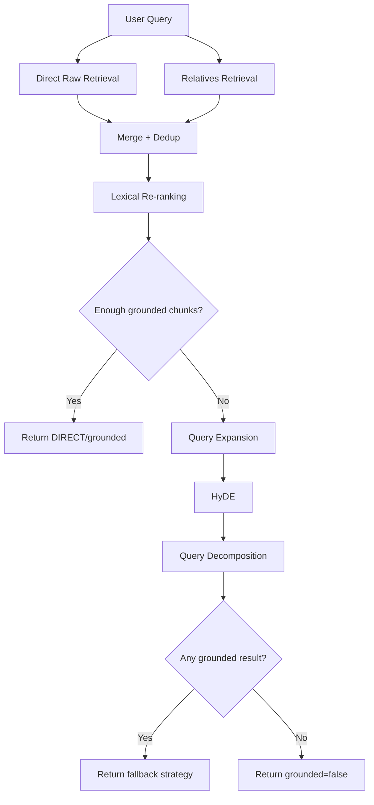

# 03. Retrieval ve Grounding

## 1. Amaç
Bu rapor, kullanıcı sorusunun hangi mekanizmalarla bağlama dönüştürüldüğünü ve sistemin ne zaman "yeterli kanıt var" dediğini açıklar. Projede güvenilirliğin kalbi retrieval katmanıdır.

## 2. Bileşenler

- `BaseRetriever`
- `SmartGroundingRetriever`
- `QueryExpander`
- `HyDERetrieval`
- `QueryDecomposer`

## 3. BaseRetriever
Bu katman ChromaDB sorgusunu kapsüller ve sonuçları `RetrievedChunk` nesnelerine dönüştürür.

Bu soyutlama şu faydaları sağlar:

- veri tabanı detaylarının üst katmana sızmaması
- raw ve relatives koleksiyonlarının aynı arayüzle kullanılabilmesi
- testlerde kolay mocking

## 4. Raw + Relatives Birleşimi
Retrieval sadece raw chunk benzerlik araması değildir. Sistem şu iki akışı birleştirir:

1. Raw içerikte doğrudan similarity araması
2. Relatives koleksiyonunda soru varyantı araması

Relatives’te eşleşme bulunursa parent raw chunk tekrar getirilir. Böylece kullanıcı sorusuyla doküman cümlesi tam benzemese bile, chunk’a ait soru varyantı üzerinden erişim sağlanır.

## 5. Fallback Zinciri
Doğrudan retrieval yetersizse sistem şu sıralı zinciri uygular:

1. Query Expansion
2. HyDE
3. Query Decomposition

### 5.1 Query Expansion
Sorgunun farklı doğal dil varyantları üretilir. Amaç, aynı intent’in farklı yüzey formlarını denemektir.

### 5.2 HyDE
Sorunun cevabıymış gibi hipotetik bir belge pasajı üretilir ve retrieval bu pasaj üzerinden denenir. Bu, özellikle doküman dili resmi ama soru dili doğal olduğunda yardımcı olur.

### 5.3 Query Decomposition
Çok parçalı soru alt sorulara ayrılır. Örneğin:

- "Yıllık izin kaç gün ve kim onaylar?"

sorusu iki atomic alt soruya bölünebilir.

## 6. Grounding Kararı
Sistem generation’dan önce retrieval sonucunun yeterli olup olmadığına karar verir. Bu kararın amacı modelin "yine de cevap vereyim" davranışını kesmektir.

Mevcut mantık:

- similarity threshold uygulanır
- threshold üstü en az bir yeterli chunk aranır
- hiçbir yeterli sonuç yoksa `grounded=false` döner

Bu tasarım, aşırı katı ayarlanırsa recall’u düşürür; aşırı gevşek ayarlanırsa yanlış grounded cevaplara yol açar.

## 7. Lexical Re-ranking
Yeni eklenen lexical re-ranking, retrieval sonrası skoru küçük ölçüde yeniden düzenler. Embedding skoru semantik yakınlığı taşırken, kelime örtüşmesi de pratik relevans sinyali sağlar.

Örnek durum:

- chunk A semantik olarak genel ama yüksek skorlu
- chunk B "müdürler kurulu" ifadesini açıkça içeriyor

Bu durumda lexical boost chunk B’yi öne taşıyabilir.

## 8. Karar Akışı

## 9. Retrieval Katmanındaki Kalite Problemleri

### 9.1 Threshold Tuning
Sabit threshold bütün belge türleri için ideal değildir.

### 9.2 Multi-document Ambiguity
Aynı kavram birden çok dokümanda geçerse source disambiguation zorlaşabilir.

### 9.3 Relatives Noise
Modelin ürettiği sorular fazla genel olursa retrieval yanlış parent chunk çekebilir.

### 9.4 Section Granularity
Chunk çok genişse retrieval doğru bölümü bulsa bile generation gereksiz fazla context alabilir.

## 10. Geliştirme Önerileri

- cross-encoder reranker eklemek
- adaptive threshold kullanmak
- document type aware retrieval parametreleri tanımlamak
- negative sample tabanlı retrieval benchmark hazırlamak
- citation-aware reranking eklemek

## 11. Sonuç
Retrieval ve grounding katmanı, sistemin güvenilirlik sigortasıdır. Bu katman ne kadar doğru çalışırsa generation katmanı o kadar kontrollü ve denetlenebilir hale gelir.
